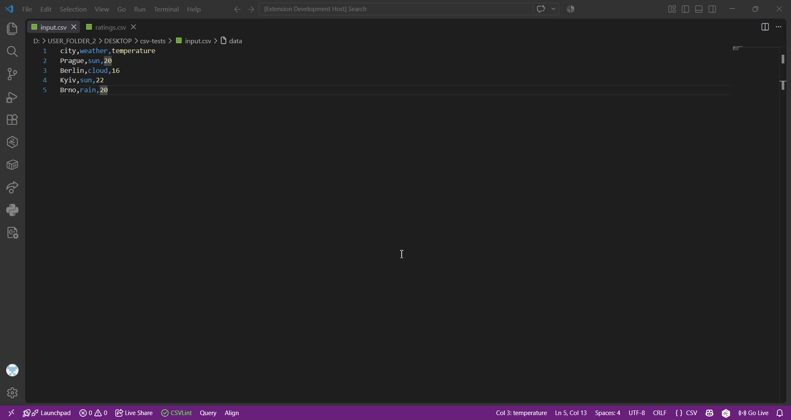
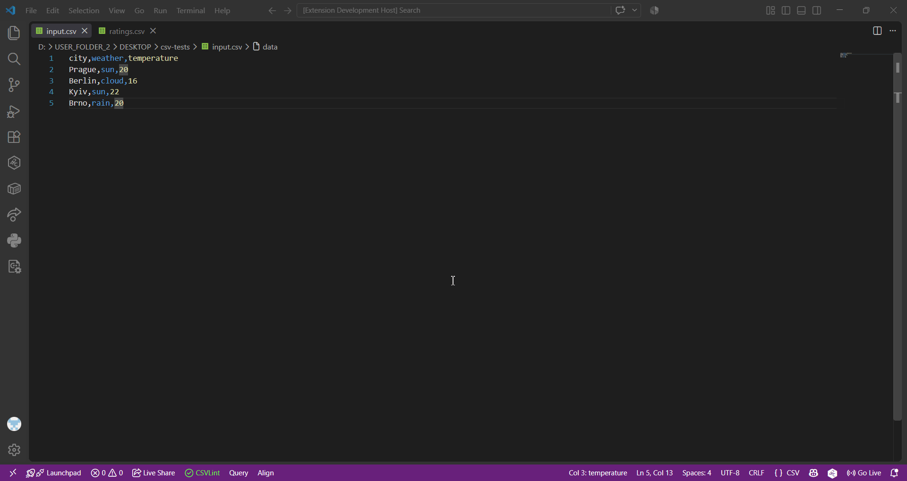
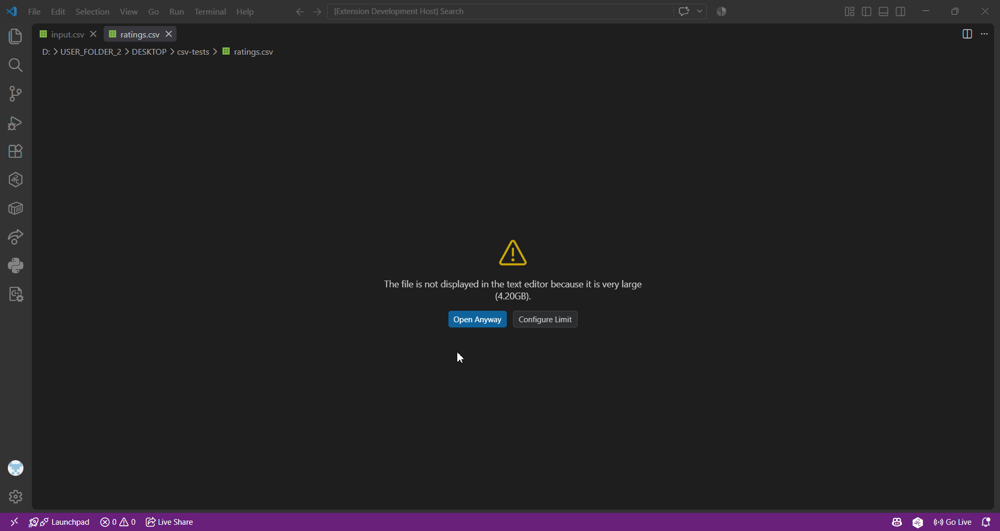

# CSV Query Engine & VS Code Extension

Generated Doxygen documentation is available at [doc/html/index.html](./docs/html/index.html)

### Demo
1. Handling small csv file:


2. Handing errors:


3. Handing large csv files:


---

## 1. Features
The description of features is provided in [CSV Query Engine VSCode Extension Specification](./CSV%20Query%20Engine%20VSCode%20Extension.md) file.

### Project Structure

#### Backend
Contains 4 projects:
- `backend` - main library with all the logic
- `backend-entry-point` - entry point to run CSV file queries
- `backend-query-header` - entry point to query the header
- `backend-tests` - backend tests

#### Frontend
[`src`](./src/) folder contains extension logic

---

## 2. Building Backend

### Prerequisites

- Visual Studio 2022 or later.

### Building with Visual Studio

1. Open solution in Visual Studio 2022 (or later version)
2. Set the build configuration to **x64-Release** in the top toolbar dropdown.
3. In the menu, go to **Build > Build All** (`Ctrl+Shift+B`)
4. Executables will be placed in the build output directory (e.g., `backend/x64/Release/`).

## 3. Running the CLI Executables

Navigate to the folder that contains executable (e.g., `backend/x64/Release/`).

### Querying a CSV file (`backend-query-csv`)

```bash

# Windows
backend-query-csv.exe ../../../samples/employees.csv output.csv "SELECT name, salary WHERE salary > 50000 ORDER BY salary DESC LIMIT 5"

# Linux
backend-query-csv ../../../samples/employees.csv output.csv "SELECT name, salary WHERE salary > 50000 ORDER BY salary DESC LIMIT 5"

```

### Reading CSV Header (`backend-query-header`)

```bash

# Windows
backend-query-header.exe ../../../samples/employees.csv

# Linux
backend-query-header ../../..samples/employees.csv

```

## 4. VS Code Extension Setup & Run

### Prerequisites
- Node.js (v18+) and npm
- VS Code

### Steps

1. Open the project root in VS Code.
2. Install dependencies:
```bash
npm install
```
3. Compile TypeScript:
```bash
npm run compile
```
4. Press `F5` to start a new **Extension Development Host** instance.
5. In the new window:
- Open a `.csv` file (e.g., `samples/employees.csv`).
- Press `Ctrl+Shift+P` (or `Cmd+Shift+P`).
- Run **Query CSV File** or **Query CSV Header**.

## 5. Running Tests
The backend project uses GoogleTest.

1. Open solution in Visual Studio 2022 (or later version)
2. Navigate to **View > Test Explorer**
3. Use `Run` or `Run All Tests In View` buttons to run all the tests

